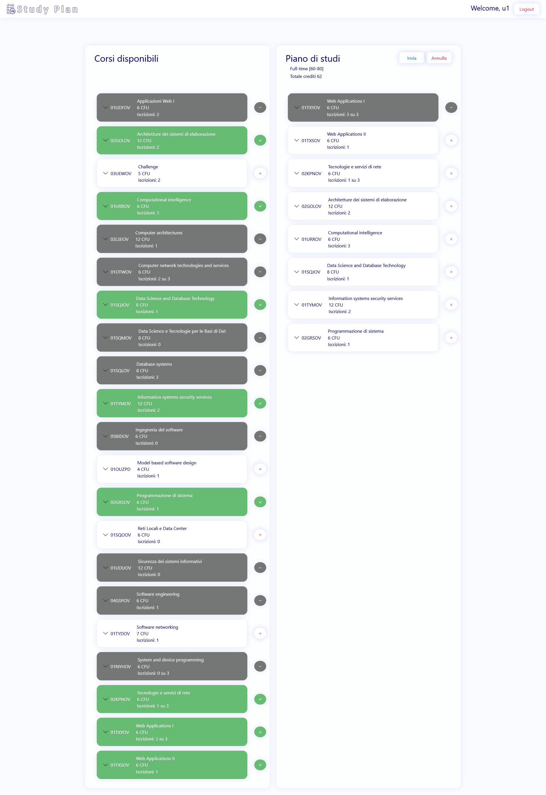

# Exam #222221: "Piano studi"

## Student: s301146 COLELLI ANTONIO

## React Client Application Routes

- Route `/`: the main page of the web application
- Route `/login`: the login page of the web application

## API Server
  To be more orderly i created a new layer called middleware which performs intermediate operations on the received/to be sended data and allows the communication between dao and api.

  For simplicity, there is a direct communication between index and user-dao.

  API:
- GET `/api/courses`

  - Description: Retrieve the list of all the courses
  - Request body: _None_
  - Response: `200 OK` (success) or `500 Internal Server Error` (generic error).
  - Response body: An array of objects, each representing one of the courses (***maxstudents***,***propaedeuticity***,***incompatibilities*** fields are dynamically showed). Error message in case of failure.

  ```
  [{
      "code": "04GSPOV",
      "name": "Software engineering",
      "cfu": 6,
      "enrolledstudents":0,
      "propaedeuticity": {"code":"02LSEOV","name":"Computer architectures","cfu":12},
      "incompatibilities":[
                          {"code":"05BIDOV","name":"Ingegneria del software","cfu":6}
                        ]
  },{
      "code": "02KPNOV",
      "name": "Tecnologie e servizi di rete",
      "cfu": 6,
      "enrolledstudents":0,
      "maxstudents":3,
      "incompatibilities":[
                          {"code":"01OTWOV","name":"Computer network technologies and services","cfu":6}
                        ]
  },{
      "code": "03UEWOV",
      "name": "Challenge",
      "cfu": 5,
      "enrolledstudents":0
    },
  ...
  ]
  ```

- GET `/api/studyplan`

  - Description: Retrieve the studyplan of the logged in user
  - Request body: _None_
  - Response: `200 OK` (success) or `404 Not Found` (study plan not found) or `500 Internal Server Error` (generic error). If the user is not logged in, `401 Unauthorized`
  - Response body:  An object representing the studyplan. The courses array has some fields each representing one of the courses (***propaedeuticity***,***incompatibilities*** fields are dynamically showed). Error message in case of failure.

  ```
  {
    "fulltime": 1,
    "totCfu": 70,
    "courses":[{
                "code": "04GSPOV",
                "name": "Software engineering",
                "cfu": 6,
                "enrolledstudents": 2,
                "propaedeuticity": {
                    "code": "02LSEOV",
                    "name": "Computer architectures",
                    "cfu": 12
              }
              },{
                "code": "02LSEOV",
                "name": "Computer architectures",
                "cfu": 12,
                "enrolledstudents": 2,
                "incompatibilities":[
                                      {
                                        "code": "02GOLOV",
                                        "name": "Architetture dei sistemi di elaborazione",
                                        "cfu": 12
                                      }   
                                    ]
              },{
              "code": "03UEWOV",
              "name": "Challenge",
              "cfu": 5
              },
          ...
            ]
  }
   ```
- POST `/api/studyplan`

  - Description: Create the studyplan for the logged in user
  - Request body: An object representing the new studyplan

  ```
  {
      "fulltime":1,
      "courses": ["04GSPOV","02LSEOV","03UEWOV"]
  }
  ```

  - Response: `201 Created` (success) or `409 Conflict`(studyplan already present for the logged in user) or `404 Not Found` (some courses does not exists) or `503 Service Unavailable` (generic error). If the request body is not valid, `422 Unprocessable Entity` (validation error). If the user is not logged in, `401 Unauthorized`.
  - Response body: _None_ in case of success and error message in case of failure.

- PUT `/api/studyplan`

  - Description: Edit an existing studyplan for the logged in user
  - Request body: An object representing the edited studyplan

  ```
  {
      "fulltime"=1,
      "courses": ["04GSPOV","02LSEOV","03UEWOV"]
  }
  ```

  - Response: `201 Created` (success) or `404 Not Found` (study plan not found or some courses does not exists) or `503 Service Unavailable` (generic error). If the request body is not valid, `422 Unprocessable Entity` (validation error). If the user is not logged in, `401 Unauthorized`.
  - Response body: _None_ in case of success and error message in case of failure.

- DELETE `/api/studyplan`

  - Description: Delete the study plan of the logged user.
  - Request body: _None_
  - Response: `204 No Content` (success) or `404 Not Found` (study plan not found) or `503 Service Unavailable` (generic error). If the user is not logged in, `401 Unauthorized`.
  - Response body: _None_ in case of success. Error message in case of failure.

- POST `/api/sessions`

  - Description: Login of a user by providing username and password.
  - Request body: An object representing the user informations.

  ```
  {
      "username":"u1@p.it",
      "password":"password"
  }
  ```

  - Response: `200 OK` (success) or `503 Service Unavailable` (generic error). If the login informations are not correct, `401 Unauthorized`.
  - Response body: User informations in case of success. Error message in case of failure.

  ```
  {
      "id": 1,
      "username": "u1@p.it",
      "name": "u1"
  }
  ```

- DELETE `/api/sessions/current`

  - Description: Logout of a logged in user.
  - Request body: _None_
  - Response: `200 OK` (success).If the user is not logged in, `401 Unauthorized`.
  - Response body: _None_

- GET `/api/sessions/current`
  - Description: Retrieve the logged user informations"
  - Request body: _None_
  - Response: `200 OK` (success) or `503 Service Unavailable` (generic error). If the user is not logged in, `401 Unauthorized`.
  - Response body: User informations in case of success. Error message in case of failure.
  ```
  {
      "id": 1,
      "username": "u1@p.it",
      "name": "u1"
  }
  ```

## Database Tables

- Table `course` - Describes the courses and contains code, name, cfu, enrolled_students,max_students, propaedeuticity
- Table `incompatibilities` - Describes the incompatibilities couses pairs and contains course_code_1, course_code_2
- Table `user_course` - Describes the enrolled courses in the studyplan of a user and contains user_id, course_code
- Table `user` - Describes the user and contains id, email, name, hash, salt,fulltime

## Main React Components

- `StudyPlanApp` (in `App.js`): contiene al suo interno gli stati per mantenere gli utenti, e gli stati della gestione del refresh globale/errore. Effettua comunicazioni con il server per la gestione delle informazioni dell'utente.

- `Home` (in `components/Home.js`): contiene al suo interno gli stati per mantenere i corsi e lo studyPlan dell'utente loggato. Il suo ruolo principale è gestire la comunicazione con il server per effettuare le chiamate che servono per leggere i corsi e fare C R U D con lo studyplan, con un occhio di riguardo a situazioni di concorrenza ( particolare enfasi sulla gestione dell'errore nell'aggiunta, da parte di 2 utenti distinti, di 2 StudyPlan che cercano entrambi di prendere l'ultimo posto disponibile in un dato corso ).

- `MainView` (in `components/MainView.js`): al suo interno non ha stati. Il suo compito è, ricevuti come props tutti gli stati/funzioni necessari dal livello superiore (Home), farsi carico della gestione LOCALE degli stati studyPlan e Courses. Fondamentalmente elabora, quando necessario, i due stati per adattarli alle diverse situazioni che si possono verificare in locale (esempio: inserisco un corso nello studyPlan cliccando un button, e MainView si occuperà di calcolare le nuove dipendenze dei corsi (un corso inserito nello studyPlan va flaggato per rendere impossibile una sua aggiunta di nuovo, oppure un corso incompatibile con il corso appena aggiunto va flaggato come impossibilitato ad entrare nello studyPlan) ). MainView è incaricato di creare lo scheletro delle due colonne che conterranno il cuore dell'applicazione grafica.

- `FirstCol` (in `components/MainView.js`): al suo interno non ha stati. Il suo compito è, ricevute (tra le varie props) la lista dei corsi e lo studyPlan, gestire la pressione (quando è stata possibile) del tasto add Course per aggiungere un corso nello studyPlan(in locale). Graficamente è incaricata di riempire la parte superiore della colonna di sinistra dell'applicazione grafica, visualizzando uno Spinner in fase di caricamento.

- `SecondCol` (in `components/MainView.js`): al suo interno non ha stati. Il suo compito è, ricevute (tra le varie props) la lista dei corsi e lo studyPlan, gestire la pressione (quando è stata possibile) del tasto remove Course per rimuovere un corso dallo studyPlan(in locale). E' quindi speculare a FirstCol, se non fosse per il fatto, non trascurabile, che gestisce tutte le varie situazioni disponibili all'utente loggato (creazione/eliminazione/modifica/annullamento di modifica di uno studyPlan locale ed inoltro al componente padre Home delle richieste di inserimento/modifica/eliminazione dello studyPlan dal db).
 Graficamente è quindi incaricata di riempire la parte superiore della colonna di destra dell'applicazione grafica, visualizzando uno Spinner in fase di caricamento.

- `CoursesManagement` (in `components/CoursesManagement.js`): al suo interno non ha stati. Questo componente è generico e viene chiamato sia da FirstCol che da SecondCol per popolare di corsi (che siano della lista completa dei corsi, o della sottolista dei corsi dello studyPlan) le colonne. Al suo interno crea un Accordion contenente il componente CourseRow, chiamato tante volte quanti sono i corsi nella lista.

- `CourseRow` (in `components/CoursesManagement.js`): al suo interno non ha stati. Questo componente gestisce il singolo corso, andando a costruire un AccordionItem e un Button che avrà come onClick la funzione passata a CourseRow tramite props (se la funzione non sarà eseguibile, sarà possibile visualizzare con un onMouseOver sul Button la motivazione tramite un OverlayTrigger). L'AccordionItem è costituito da un Header e da un Body. Il loro contenuto è gestito rispettivamente nei componenti CourseData e SubCourseData

- `CourseData` (in `components/CoursesManagement.js`): al suo interno non ha stati. Questo componente crea una struttura per l'header dell'AccordionItem, con le informazioni del corso da mostrare in primo piano

- `SubCourseData` (in `components/CoursesManagement.js`): al suo interno non ha stati. Questo componente crea una struttura per il body dell'AccordionItem, con le informazioni del corso da mostrare dopo l'espansione dell'AccordionItem.

- `CommonTopSide` (in `components/CommonTopSide.js`): al suo interno non ha stati. Come suggerisce il nome, questo componente gestisce la parte di visualizzazione comune a tutte le route (la parte superiore). E' composto dai componenti secondari GlobalNavbar(banalmente, la navBar) e ErrorAlert (utilizzato per mostrare un eventuale messaggio di errore come ad esempio l'impossibilità di comunicare con il server o la presenza di situazioni concorrenziali ), e da uno Spinner per il caricamento iniziale dell'applicazione. E' il contenitore dell'Outlet.

- `LoginForm` (in `components/LoginComponents.js`): è il componente che gestisce il login di un utente.

## Screenshot



## Users Credentials
```
 u1@p.it : password
 "full-time"
```
```
  u2@p.it : password
  "full-time"
```
```
 u3@p.it : password
 "part-time"
```
```
 u4@p.it : password
 "no study plan"
```
```
 u5@p.it : password
 "no study plan"
```
